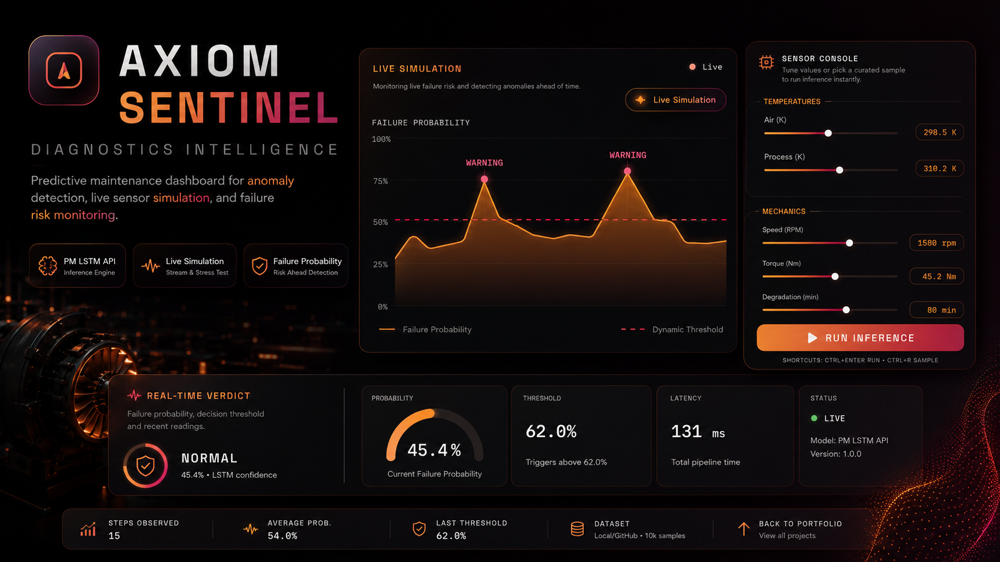
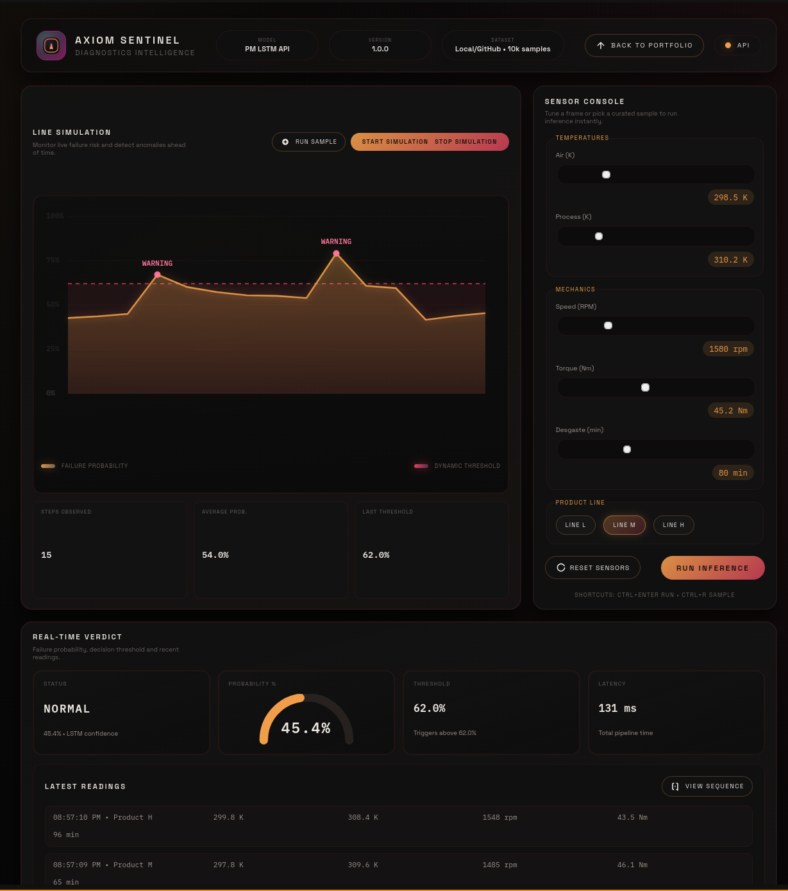

<p align="center">
  
</p>

<p align="center">
  <strong>FastAPI · TensorFlow (LSTM) · NumPy · Uvicorn</strong><br />
  <em>REST API for binary failure-risk scoring from multivariate sensor sequences — built for Docker / Hugging Face Spaces and custom frontends.</em>
</p>

<p align="center">
  <a href="https://github.com/sidnei-almeida/predictive_maintenance_lstm"><strong>github.com/sidnei-almeida/predictive_maintenance_lstm</strong></a>
</p>

<p align="center">
  
  
  
</p>

---

## Why this project

Industrial teams need **early warning** before equipment fails. This service implements a **sequence model** perspective: an **LSTM** reads **50 consecutive timesteps** of engineered sensor features and outputs a **failure probability** in **[0, 1]** (binary risk). A **FastAPI** layer exposes that model to browsers, dashboards, or other backends over HTTP — CPU-oriented defaults keep hosting simple.

---

## Dashboard & operator experience

The UI concept below (**live simulation**, **sensor console**, **thresholded risk**, latency and verdict cards) maps cleanly onto the API: sliders and “run inference” actions translate to **`POST /predict`**, while health/metadata feeds power status chips.

<p align="center">
  
</p>

<p align="center">
  <sub>Example frontend layout: streaming risk curve, manual sensor inputs, and real-time LSTM verdict.</sub>
</p>

*(Any frontend can integrate — the repository ships the **API** and model assets.)*

---

## How inference works (summary)

1. **Features per timestep (7):** `air_temperature_k`, `process_temperature_k`, `rotational_speed_rpm`, `torque_nm`, `tool_wear_min`, plus one-hot style flags **`type_l`** and **`type_m`** for product line **L / M** (type **H** leaves both flags at `0`).
2. **Sequence length:** **50** steps. Shorter inputs are **padded** with the last row; longer inputs keep the **most recent** 50 rows.
3. **Output:** sigmoid **probability**; **`predicted_label`** is `1` if probability ≥ **0.5** (configurable threshold in response metadata today fixed at 0.5 in `PredictionResponse`).
4. **Resilience:** If **TensorFlow** cannot load, a **`SimulatedModel`** heuristic answers requests so deployments stay demo-friendly (`details.uses_simulated_model` tells you which path ran).

Artifacts load from **`modelos/`** and **`dados/`** when present; otherwise the app **downloads** `.keras` / `.npy` / `training_summary.json` from the configured GitHub **raw** base URL inside `app.py` (sibling repo name may differ — check `REMOTE_BASE_URL` before forking).

---

## API reference

| Method | Path | Description |
|--------|------|-------------|
| GET | `/` | Short JSON with links to docs and core routes. |
| GET | `/health` | Model / data / training JSON availability + TensorFlow flag. |
| GET | `/metadata` | Project string, `features`, `sequence_length`, dataset & training summaries. |
| GET | `/sample` | Random row from processed arrays, tiled to a sequence, with a prediction. |
| POST | `/predict` | Body with either a **single reading** or a full **preprocessed sequence**. |

Interactive OpenAPI: **`/docs`** · **ReDoc:** `/redoc`

### `POST /predict` — single sensor snapshot

The API **tiles** one reading across 50 steps (valid for “what-if” and demos):

```json
{
  "reading": {
    "air_temperature_k": 298.0,
    "process_temperature_k": 310.0,
    "rotational_speed_rpm": 1500.0,
    "torque_nm": 45.0,
    "tool_wear_min": 120.0,
    "product_type": "L"
  }
}
```

`product_type` ∈ `H` | `L` | `M`.

### `POST /predict` — explicit sequence

Send **`[timesteps, 7]`** floats (already scaled the same way as training). Padding / trimming rules above apply.

```json
{
  "sequence": [
    [0.12, 0.32, -0.48, 0.21, 0.45, 0.0, 1.0],
    [0.10, 0.30, -0.50, 0.22, 0.46, 0.0, 1.0]
  ]
}
```

### Example response (shape)

```json
{
  "probability": 0.7421,
  "predicted_label": 1,
  "threshold": 0.5,
  "details": {
    "sequence_steps": 50,
    "features_order": [
      "air_temperature_k",
      "process_temperature_k",
      "rotational_speed_rpm",
      "torque_nm",
      "tool_wear_min",
      "type_l",
      "type_m"
    ],
    "uses_simulated_model": false
  }
}
```

---

## Run locally

```bash
git clone https://github.com/sidnei-almeida/predictive_maintenance_lstm.git
cd predictive_maintenance_lstm

python -m venv .venv
source .venv/bin/activate   # Windows: .venv\Scripts\activate

pip install --no-cache-dir -r requirements.txt
uvicorn app:app --host 0.0.0.0 --port 7860 --reload
```

Browse **`http://127.0.0.1:7860/docs`**.

> **TensorFlow CPU** is the default (`tensorflow-cpu` in requirements). GPU is explicitly disabled in `app.py` for predictable cloud builds.

---

## Docker & Hugging Face Spaces

- **`Dockerfile`** targets container deployment; Spaces typically run **`uvicorn app:app`** on the platform port.
- **Large artifacts** (`.keras`, `.npy`) may use **Git LFS** — install Git LFS and run **`git lfs pull`** after clone.
- **`packages.txt`** (when present) can carry OS libraries TensorFlow expects on Debian/Ubuntu images.

---

## Repository layout

| Path | Role |
|------|------|
| `app.py` | FastAPI app, loaders, `SimulatedModel`, inference. |
| `modelos/predictive_maintenance_model.keras` | Trained LSTM (when committed / LFS). |
| `dados/X_processed.npy`, `dados/y_processed.npy` | Processed tensors for `/sample` & stats. |
| `treinamento/training_summary.json` | Metrics / hyperparameters surfaced in `/metadata`. |
| `notebooks/` | Exploration & training notebooks (if present). |
| `Dockerfile`, `requirements.txt` | Runtime image & Python deps. |
| `images/header.png` | README hero graphic. |
| `images/software.png` | README dashboard preview. |

---

## Frontend integration checklist

1. **`GET /metadata`** once — populate about-screens and feature order.  
2. **`GET /health`** — show model/data readiness and whether TensorFlow is live.  
3. **`POST /predict`** — bind sliders / forms to `reading` or send your own `sequence` buffer.  
4. **`GET /sample`** — quick QA or demo mode.

---

## Safety & disclaimer

Predictions are **experimental** and depend on training distribution, sensor quality, and preprocessing parity. **Do not** use this as the sole signal for safety-critical or legally regulated maintenance decisions. Always follow vendor procedures and local regulations.

---

## License

MIT License — include a `LICENSE` file in the repository when distributing.

---

## Author

**Sidnei Almeida** — [github.com/sidnei-almeida](https://github.com/sidnei-almeida) · contributions welcome.
